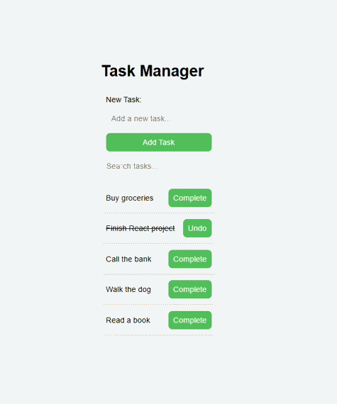

# Task Manager

A React application that allows users to create, manage, and search tasks. This project demonstrates the use of React Hooks and Context API to manage application state and improve component communication.

## Features

- View tasks loaded from a JSON server
- Add new tasks
- Mark tasks as complete or undo completed tasks
- Search tasks dynamically
- Global state management using React Context
- Accessible form inputs using `useId`
- Search functionality implemented with `useRef`

## Technologies Used

- React
- Vite
- JavaScript (ES6+)
- Context API
- JSON Server
- React Hooks
  - `useState`
  - `useEffect`
  - `useContext`
  - `useId`
  - `useRef`

## Demo



## Installation

Clone the repository:

```bash
git clone https://github.com/your-username/task-manager.git
```

Navigate to the project directory:

```bash
cd task-manager
```

Install dependencies:

```bash
npm install
```

## Running the Application

Start the React development server:

```bash
npm run dev
```

Start the JSON server:

```bash
npm run server
```

## Running Tests

Run the test suite:

```bash
npm run test
```

## Project Structure

```text
src/
├── components/
│   ├── App.jsx
│   ├── SearchBar.jsx
│   ├── TaskForm.jsx
│   └── TaskList.jsx
├── context/
│   └── TaskContext.jsx
├── index.css
├── main.jsx
└── db.json
```

## React Hooks Used

### useContext

Used to provide and consume global task state throughout the application without prop drilling.

### useId

Used to generate a stable, unique identifier that links form labels to their corresponding input elements for accessibility.

### useRef

Used to access the search input value without creating a controlled component.

### useState

Used to manage local component state such as form input values and global task state.

### useEffect

Used to load task data from the backend when the application initializes.

## Learning Objectives

This project demonstrates:

- Managing global state with Context API
- Working with asynchronous API requests
- Updating backend data with POST and PATCH requests
- Building accessible forms
- Using React Hooks to manage component behavior and state

## Author

Created by Matthew Swanberg as part of a React Standard Hooks lab assignment (Course 5, Module 4).